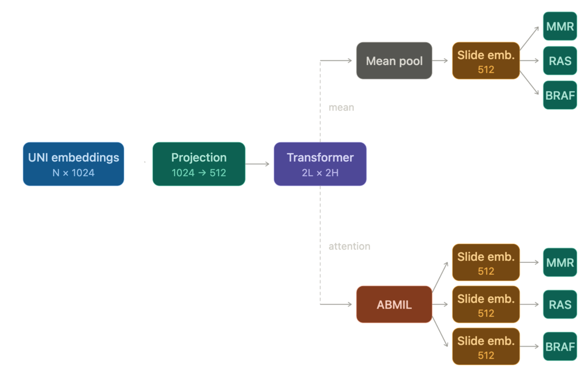
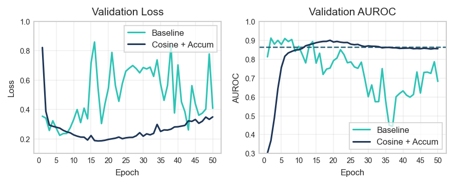
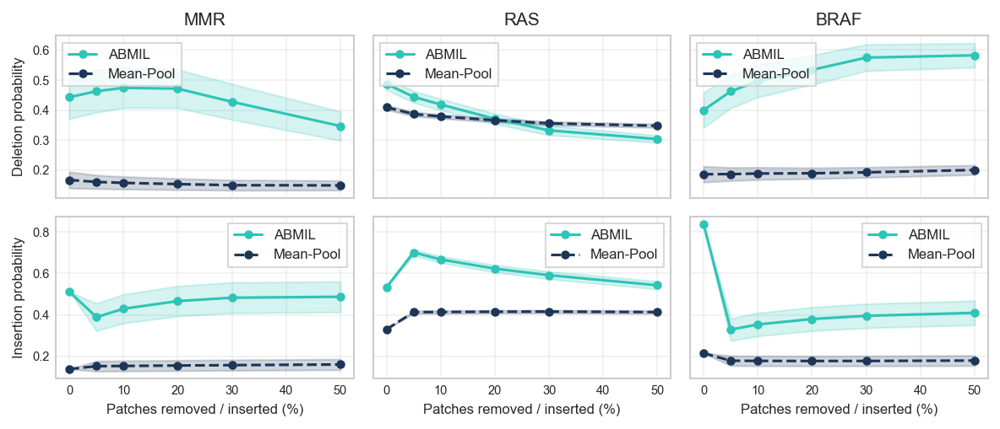
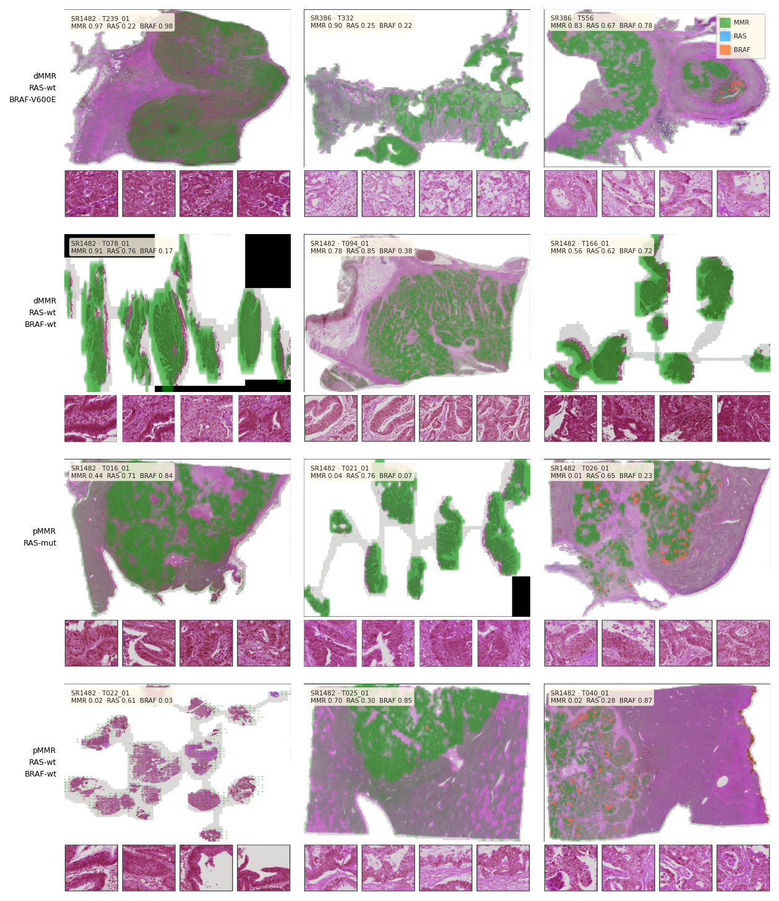

# Multitask Prediction of Mismatch Repair Deficiency and Oncogenic Mutations from Colorectal Cancer Whole-Slide Images

**Author:** Christian Landeros, PhD
**Date:** 2026-03-17 

---

## Abstract

We investigate simultaneous prediction of three clinically actionable molecular markers — MMR status, RAS mutation, and BRAF V600E mutation — from H&E whole-slide images of colorectal cancer, using the SurGen dataset (Myles et al., 2025). Patch embeddings are extracted from a frozen UNI foundation model and processed under a multiple instance learning framework in which a two-layer Transformer encoder aggregates patch-level representations into slide-level predictions. Two aggregation strategies are compared: mean pooling and attention-based MIL (ABMIL), in which task-specific gating networks learn independent patch weightings for each prediction head. A learned relative position bias (MLP-RPB) is evaluated as an extension to the ABMIL architecture to incorporate spatial relationships between patches. Training stability is first established on single-task MMR prediction, then extended to the multitask setting. Model faithfulness is assessed via deletion and insertion perturbation curves using InputXGrad attribution scores, and spatial attribution is examined across a biologically stratified set of test slides grouped by the co-occurrence of MMR, RAS, and BRAF status.

---

## 1. Clinical Motivation

In the release of the SurGen dataset consisting of 1,020 H&E-stained whole-slide images from 843 colorectal cancer (CRC) cases, Myles et al. present a proof-of-concept Transformer-based classifier that achieves a test AUROC of 0.8273 for predicting mismatch repair (MMR) status. This project aims to build on this foundation, and establish a predictive link between slide morphology and a broader panel of genetic markers that inform CRC treatment decision-making. Alongside MMR, the model was extended to jointly predict mutations in the KRAS and NRAS genes (collectively RAS) and the BRAF oncogene. Genetic testing results for these markers inform critical treatment decisions for patients with new diagnoses (Table 1).

Pathological studies have identified characteristic histologic features associated with each of these genetic markers. For example, mismatch repair deficient (dMMR) tumors are characterized by dense tumour-infiltrating lymphocytes and poorly differentiated pushing borders, whereas mismatch repair proficient (pMMR) tumours typically display well-to-moderately differentiated glandular architecture and comparatively sparse lymphocytic response. BRAF V600E mutations, causally linked to a subset of non-hereditary dMMR cases, typically demonstrate serrated glandular architecture, eosinophilic cytoplasm, and extracellular mucin. Finally, RAS-mutant tumours present more subtle morphological markers; KRAS-mutant tumours, specifically, tend tend toward better differentiation and are less frequently mucinous. 

Because BRAF mutation is itself a frequent driver of MMR deficiency, we expect significant overlap in the slide regions that contribute to positive MMR and BRAF predictions. Conversely, the RAS head should attend to largely distinct regions. Beyond test set performance, this project aims to verify the model's concordance with these established morphological associations through careful interpretability analysis. Doing so provides a clinically-grounded consistency check that is crucial in early-stage development to avoid investment in models whose performance relies on spurious correlations rather than genuine histopathological signals.

| MMR | RAS | BRAF | H&E morphology signal | Treatment Implication |
|---|---|---|---|---|
| dMMR | wt | V600E | Strong: mucinous, serrated glands, poor differentiation, dense TILs, pushing borders | ICI eligible (sporadic) |
| dMMR | mut | wt | Moderate: TILs, Crohn-like reaction; less mucinous; variable site | ICI eligible; anti-EGFR excluded |
| dMMR | wt | wt | Moderate: TILs, lymphoid aggregates; younger patients; any site | ICI eligible; Lynch screening necessary |
| pMMR | wt | wt | Non-specific: conventional adenocarcinoma; no distinguishing features | Chemo ± anti-EGFR |
| pMMR | mut | wt | Non-specific: no reliable morphological difference vs RAS-wt | Chemo; anti-EGFR excluded |
| pMMR | wt | V600E | Moderate: may show serrated features, mucinous component; proximal | Poor prognosis; BRAF-targeted therapy |

**Table 1. Representative genotype combinations and their clinical implications.** H&E morphology signal strength reflects the degree to which each combination is associated with identifiable histologic features. Treatment implications follow current CRC management guidelines. ICI: immune checkpoint inhibitor; TILs: tumour-infiltrating lymphocytes; mCRC: metastatic colorectal cancer.

---

## Methods

### 2.1 The SurGen Dataset

We use the SurGen dataset (Myles et al., 2025), consisting of 1,020 H&E-stained whole-slide images (WSIs) from 843 CRC cases, collected at NHS Lothian, Scotland. The dataset is divided into two cohorts: SR386 (427 WSIs from 427 primary colorectal cases with five-year survival data) and SR1482 (593 WSIs from 416 cases including metastatic sites such as liver, lung, and peritoneum). All slides were digitised at 40× magnification (0.1112 μm per pixel) in Carl Zeiss Image (CZI) format.

Training input to the model is provided by pre-extracted patch-level embeddings produced by the UNI foundation model (Chen et al., 2024). This encoding model is a self-supervised vision encoder trained on over 100,000 H&E-stained WSIs, using the DINOv2 self-supervised framework (Oquab et al., 2023). Feature extraction was performed on non-overlapping 224 × 224-pixel tissue patches at a resolution of 1.0 microns per pixel (MPP), with background subtraction applied to exclude non-tissue regions. Each patch yields a 1,024-dimensional embedding vector, stored in Zarr format alongside the dataset.

For our multitask formulation, each slide is annotated with three binary labels: mismatch repair (MMR) / microsatellite instability (MSI) status, BRAF mutation status, and a combined RAS mutation status (union of KRAS and NRAS). The distribution of these annotations across the stratified training, validation, and test splits is reported in Table 2. Each example may have 1 to 3 valid labels. Splits follow a 60:20:20 stratification.

| Task | Split | N | Positive | Negative | Pos% |
|---|---|---|---|---|---|
| MMR / MSI | Train | 490 | 50 | 440 | 10.2 |
| | Val | 165 | 14 | 151 | 8.5 |
| | Test | 165 | 15 | 150 | 9.1 |
| RAS | Train | 489 | 216 | 273 | 44.2 |
| | Val | 165 | 69 | 96 | 41.8 |
| | Test | 164 | 67 | 97 | 40.9 |
| BRAF | Train | 448 | 63 | 385 | 14.1 |
| | Val | 154 | 20 | 134 | 13.0 |
| | Test | 154 | 21 | 133 | 13.6 |

**Table 2. Per-task label distribution across training, validation, and test splits.** Labels are derived from unified SurGen MMR/MSI annotations, BRAF mutation status, and a combined RAS label (union of KRAS and NRAS). Not all cases have annotations for every task; the total unique case count across all tasks is shown in the final row. Splits follow a 60:20:20 stratification preserving class balance.

### 2.2 Architecture

The pipeline follows the multiple instance learning (MIL) paradigm. Each WSI is treated as an unordered bag of patch embeddings, and the model is trained to produce slide-level predictions. In the initial training stability experiments (Section 3.1), we adopt the single-task architecture of Myles et al. (2025) without modification. Frozen UNI embeddings are mapped from 1,024- to 512-dimensional space through a fully connected layer with ReLU activation. The projected tokens are passed through a two-layer Transformer encoder (Vaswani et al., 2017) with 2 attention heads, feed-forward dimension 2,048, dropout 0.15, and layer-norm ε = 1 × 10⁻⁵. Transformed tokens are mean-pooled across the patch dimension to produce a single slide-level representation, which is passed to a linear classification head that outputs a scalar logit.
For multitask experiments (Section 3.2), two modifications were introduced. First, the single classification head was replaced by T = 3 independent heads for MMR, RAS, and BRAF. Second, mean pooling was optionally replaced by attention-based MIL aggregation (ABMIL; Ilse et al., 2018). In this variant, Transformer outputs are first layer-normalised, then passed through a two-layer MLP with GELU activation (hidden dimension 128). The first layer of this MLP is shared across all tasks, learning a general patch-importance representation. The second layer produces T independent scalar scores per patch. Scores are softmax-normalised across the patch dimension independently per task, yielding T separate attention distributions. Each task-specific weighted sum is then passed to its own classification head. This architecture is demonstrated in Figure 1.
In the positional encoding ablation (Section 3.3), MLP-RPB augments the Transformer encoder with spatial awareness. For each pair of patches, the normalised relative coordinates (Δrow, Δcol), scaled to [−1, 1] per slide, are projected by a learned linear layer to produce one scalar bias per attention head. This bias is added to the attention logits before softmax, allowing the encoder to modulate patch interactions based on spatial proximity without altering the token representations themselves.

**Figure 1. Multi-task MIL architecture for predicting molecular markers from slide patch embeddings.** Frozen UNI patch embeddings (N × 1024) are projected to 512 dimensions and processed by a 2-layer, 2-head Transformer encoder. Two aggregation strategies are compared: mean pooling produces a single shared slide embedding, while ABMIL generates task-specific slide embeddings via learned attention distributions. Each branch feeds independent binary classification heads for MMR status, RAS mutation, and BRAF mutation.

---

### 2.3 Training Protocol

All models are trained on pre-extracted UNI patch embeddings with a batch size of one, as the number of patches varies across slides. The loss function is binary cross-entropy with logits. In the multitask setting, each task head receives an independent loss term, and the total loss is calculated as the unweighted mean; slides with missing annotations for a given task are masked from that head's gradient. Automatic mixed precision is enabled throughout. All models are implemented in PyTorch and trained on a single NVIDIA Tesla T4 GPU. Experiment tracking is managed with MLflow (Zaharia et al., 2018).

*Baseline Reproduction (Single-Task MMR).* Two single-task MMR configurations were trained with a single seed for 50 epochs with no early stopping. The baseline replicates the Myers et al. (2025) protocol: Adam at lr = 1 × 10⁻⁴, constant learning rate, no gradient accumulation. The cosine + accumulation candidate uses Adam at lr = 1 × 10⁻⁵ with cosine annealing (5-epoch linear warmup, T_max = 100, η_min = 1 × 10⁻⁶) and ×16 gradient accumulation (effective batch size 16).

*Multitask Joint Prediction.* The model is extended to jointly predict MMR, RAS, and BRAF mutation status. To address class imbalance, per-head inverse-frequency weighting sets the positive-class weight to the ratio of negative to positive training examples. Two aggregation strategies are compared: mean pooling and attention-based aggregation (ABMIL). Both use early stopping with a patience of 25 epochs and are evaluated across 3 independent random seeds, and results are reported as mean ± standard deviation.

*Positional Encoding Ablation.* MLP-RPB positional encoding is evaluated against the no-PE baseline. All configurations share the multitask joint prediction training protocol. Each is run with 3 independent random seeds and results are reported as mean ± standard deviation.

### 2.4 Evaluation Metrics

**AUROC.** The area under the receiver operating characteristic curve is the primary discriminative metric, computed from sigmoid output probabilities and binary ground-truth labels using the scikit-learn Python library. It measures rank discrimination regardless of operating threshold and is well-suited to the class-imbalanced tasks here (particularly BRAF, ~10% positive rate).

**AUPRC.** The area under the precision–recall curve is reported alongside AUROC for all tasks, computed via the scikit-learn Python library (interpolated trapezoidal rule). Precision (TP / (TP + FP)) and recall (TP / (TP + FN)) are plotted across thresholds; a random classifier achieves AUPRC equal to the class prevalence rather than 0.5, so gains above that baseline reflect genuine positive-class recall.

### 2.5 Interpretability Methods

#### 2.5.1 Deletion and Insertion Studies

Deletion and insertion curves were computed under the XMIL label-agnostic protocol (Hense et al., 2024; Idaji et al., 2026). The two models chosen for analysis were the ABMIL and mean-aggregation variants described in Section 2.2, each evaluated across 3 independent seeds. Slides were drawn from the test set and class-balanced per task by downsampling the majority class to match the minority class size; the same slide IDs were used for both model groups. For deletion, the top-k% highest-scored patches were removed from the bag and a forward pass was run on the reduced bag at k ∈ {0, 5, 10, 20, 30, 50}%. For insertion, the bag was initialised as N copies of the global-mean patch embedding (precomputed from all test-set patches), with the top-k% patches progressively replaced by their real embeddings at the same k-levels. The primary evaluation metric is Salient Region Gain (SRG), computed per slide and averaged across slides. SRG is defined as the difference in area under the perturbation curve between the insertion and deletion conditions, where each area is estimated by trapezoidal integration of the model's predicted positive-class probability over the six perturbation levels, normalised by the maximum perturbation fraction (k_max = 0.50).

Patch saliency scores were computed using two methods: attention weights and InputXGrad. Attention weights are the task-specific softmax-normalised scores produced by the ABMIL gating network (Section 2.2) and are applicable to the ABMIL model only. InputXGrad computes the element-wise product of each patch embedding and the gradient of the output logit with respect to that embedding, (Baehrens et al., 2010). The L2-norm of this product yields a scalar saliency score per patch. InputXGrad is applicable to both ABMIL and mean-pool models, and scores are averaged across seeds in both cases.

#### 2.5.2 Attention Heatmaps

Attention heatmaps were produced for a biologically stratified subset of test slides selected to probe the concordance hypothesis introduced in Section 1. Each slide was assigned to one of four categories defined by the combination of its MMR status (dMMR or pMMR), BRAF V600E status (V600E or wild-type), and RAS mutation status (mutant or wild-type). Group (i), dMMR/V600E/RAS-wt, represents the scenario in which BRAF mutation drives MMR deficiency. Group (ii), dMMR/BRAF-wt/RAS-wt, isolates MMR deficiency arising without BRAF involvement. Group (iii), pMMR/BRAF-wt/RAS-mut, represents a group that should focus only on RAS. Group (iv), pMMR/BRAF-wt/RAS-wt, serves as a triple-negative baseline in which no task head carries a strong positive signal. 3 slides were chosen per group, ranked by prediction confidence in the label-correct direction.

Per-task input×gradient (IXG) attribution scores (Section 2.5.1) were computed for each slide, producing one signed importance value per patch for each of the three task heads. These scores were projected onto a two-dimensional spatial grid using stored patch coordinates. To enable visual comparison across slides, each map was normalised to [0, 1] per slide. Three-panel figures showing MMR, BRAF, and RAS attribution were produced per slide, alongside a combined gallery. To quantify spatial concordance between task heads, a top-k% Jaccard overlap was computed per slide. For each task pair (MMR–BRAF and MMR–RAS), the top 5% of patches by absolute IxG score were selected independently per head, and Jaccard overlap (|A∩B|/|A∪B|) was computed over these sets. The random-chance Jaccard baseline at k=5% is approximately 0.026.

To quantify spatial concordance between task heads, a top-k% Jaccard overlap was computed per slide. For each task pair (MMR–BRAF and MMR–RAS), the top 5% of patches by absolute IxG score were selected independently per head, and Jaccard overlap (|A∩B|/|A∪B|) was computed over these sets. The random-chance Jaccard baseline at k=5% is approximately 0.026.

---

## 3. Results

### 3.1 Baseline Reproduction (Single-Task MMR)

Myles et al. (2025) reported a test AUROC of 0.8273 for MMR prediction on the full SurGen dataset when trained for 200 epochs. As evidenced by Figure 12 of their report, the validation loss and AUROC exhibited great epoch-to-epoch variability. The first objective of the study was to reproduce the results seen in the paper, and to stabilize the training dynamics. Two single-task MMR configurations were each trained for 50 epochs with a single seed. The baseline run confirmed the same instability observed by Myles et al., with validation AUROC peaking at epoch 2 before degrading; this checkpoint achieved a test AUROC of 0.864. The cosine annealing with gradient accumulation variant yielded smooth convergence over 19 epochs and matched this performance (test AUROC 0.864), but with markedly more stable training dynamics (Figure 2). This configuration was adopted for all subsequent experiments.

**Figure 2. Training Stability: Baseline vs. Cosine LR + Gradient Accumulation.** Validation loss and AUROC over the first 50 epochs for two single-task MMR runs. The baseline diverges after an early peak; cosine annealing with ×16 gradient accumulation yields smooth, monotonic convergence.

### 3.2 Multitask Joint Prediction

In the second phase of experimentation, the model was extended to jointly predict MMR, RAS, and BRAF mutation status from a single whole-slide image. Clinical management of CRC routinely requires all three markers, motivating a unified model that produces them in a single forward pass. We further reasoned that the partial overlap in morphologic correlates among these mutations would provide a complementary training signal.

Two patch-aggregation strategies were compared: the mean-pooling baseline and the attention-based variant (ABMIL; Section 2.2). Test set AUROC and AUPRC per task are reported in Table 2. AUPRC should be interpreted relative to the positive-class prevalence for each task: approximately 10% for MMR, 44% for RAS, and 14% for BRAF. Replacing mean pooling with ABMIL improved mean test AUROC from 0.751 to 0.784 and reduced inter-seed variance across all three tasks.

| Aggregation | Task | Test AUROC | Test AUPRC |
|---|---|---|---|
| Mean | MMR | 0.813 ± 0.063 | 0.346 ± 0.073 |
| | RAS | 0.632 ± 0.023 | 0.526 ± 0.013 |
| | BRAF | 0.809 ± 0.046 | **0.449 ± 0.097** |
| | Mean | 0.751 ± 0.043 | 0.440 ± 0.055 |
| ABMIL | MMR | **0.852 ± 0.015** | **0.384 ± 0.006** |
| | RAS | **0.651 ± 0.006** | **0.526 ± 0.012** |
| | BRAF | **0.848 ± 0.016** | 0.440 ± 0.018 |
| | Mean | **0.784 ± 0.007** | **0.450 ± 0.003** |

**Table 2. Multitask test performance.** Mean pooling (Phase 5 config re-run with 3 independent seeds) vs. ABMIL (Phase 8 baseline, no positional encoding). Both reported as mean ± std across 3 seeds.

Results indicate that ABMIL aggregation, which permits each task head to learn an independent patch weighting, improved both discriminative performance and training stability relative to mean pooling.

### 3.3 Positional Encoding Ablation

The preceding experiments treat each slide as an unordered bag of patches. We next investigated whether encoding spatial relationships might allow the model to leverage local structural relationships in its decision-making. For example, the Crohn's-like peritumoral lymphoid aggregates characteristic of dMMR tumours typically span multiple adjacent patches, and their recognition may benefit from explicit spatial context. A learned relative position bias (RPB) was introduced, in which a linear projection maps pairwise coordinate offsets between patches to an additive bias term in the self-attention computation. The ABMIL architecture from Section 3.2 was evaluated with and without the RPB layer; results are reported in Table 3.

| PE | Task | AUROC | AUPRC |
|---|---|---|---|
| None | MMR | 0.852±0.015 | 0.384±0.006 |
| | RAS | 0.651±0.006 | 0.526±0.012 |
| | BRAF | 0.848±0.016 | 0.440±0.018 |
| | Mean | 0.784±0.007 | 0.450±0.003 |
| Rel. Pos. Bias | MMR | 0.858±0.008 | 0.384±0.010 |
| | RAS | 0.645±0.011 | 0.521±0.006 |
| | BRAF | 0.830±0.010 | 0.416±0.037 |
| | Mean | 0.778±0.008 | 0.440±0.015 |

**Table 3. Positional encoding ablation.** Mean ± std across 3 seeds. Phase 8 baseline is no-PE (first block).

The addition of RPB did not improve overall performance, reducing mean test AUROC marginally from 0.784 to 0.778. The effect was not uniform across tasks: MMR AUROC increased slightly (0.852 to 0.858) with reduced inter-seed variance, while BRAF AUROC fell from 0.848 to 0.830. More investigation will be necessary to determine whether the MMR improvement reflects improved recognition of larger-scale structures. Given the absence of a clear overall gain, the baseline ABMIL model without positional encoding was carried forward to the interpretability analysis.

---

### 3.4 Interpretability Analysis

Interpretability is central to the clinical utility of any pathology model. One validation approach aims to verify spatial attribution against known histologic correlates. If model decision-making is based on regions that pathologists recognise as diagnostically relevant, confidence in the underlying learned representation is strengthened. The analyses below use the ABMIL configuration without positional encoding, carried forward from Section 3.3. 

#### 3.4.1 Deletion / Insertion Study

From the clinical perspective, validation studies for any pathology model naturally begin with identifying which regions of the slide most contribute to its predictions. This spatial analysis lends itself to clinical verification in settings where the correlation between histologic morphology and molecular status is well established. For example, dMMR tumours are characterized by dense tumour-infiltrating lymphocytes, visible on H&E as clusters of small, darkly basophilic cells within or adjacent to tumour nests. If the model's highest-scoring patches coincide with such regions, confidence in the learned representation is strengthened.

Attribution methods assign an importance score to each patch, and thus allow us to visualize slide-level patterns. However, these scores are only useful if the highest-ranked patches are genuinely necessary for the prediction. To test this, a deletion and insertion experiment was performed. Patches were ranked by descending attribution score. In the deletion experiment, the top k% were progressively removed at k ∈ {5, 10, 20, 30, 50}%. In the complementary insertion experiment, patches were added in the same rank order starting from an empty bag. A faithful attribution method should produce a steep decline in predicted probability under deletion and a rapid recovery under insertion. 

Two attribution methods were compared: (i) the gating attention weights from the ABMIL aggregation layer (ATTN), and (ii) input × gradient (IXG), the element-wise product of each patch embedding with the gradient of the predicted logit with respect to that embedding (See Section 2.5.1). The first is specific to ABMIL; the second can be applied to any aggregation strategy, enabling a direct comparison between ABMIL and mean-pool architectures. Faithfulness was quantified by the saliency ranking gap (SRG = insertion AUC − deletion AUC). A higher SRG indicates that the attribution method more effectively distinguishes important from unimportant patches. Results are reported in Table 4.

**Table 4. Saliency Ranking Gap (SRG) by aggregation strategy and task.** SRG = AUPC_ins − AUPC_del (higher = more faithful). Values are mean ± std across slides after class-balanced sampling. Attn not applicable to mean-pool. Bold = best per task within each column. N = slide count per task after min(n_pos, n_neg) balancing.

| Aggregation | Task |  N  | SRG ixg (↑) | SRG attn (↑) |
|---|---|---|---|---|
| ABMIL     | MMR  |  30 | **0.033 ± 0.24** | −0.043 ± 0.27 |
| ABMIL     | RAS  | 134 | **0.241 ± 0.14** |  0.244 ± 0.15 |
| ABMIL     | BRAF |  42 | −0.132 ± 0.19  | −0.170 ± 0.21 |
| ABMIL     | *Mean* | — |  *0.047* | *0.010* |
| Mean-pool | MMR  |  30 |  0.001 ± 0.04  | — |
| Mean-pool | RAS  | 134 |  0.045 ± 0.05  | — |
| Mean-pool | BRAF |  42 | **−0.013 ± 0.04** | — |
| Mean-pool | *Mean* | — | *0.011* | — |

Within the ABMIL model, IXG achieved higher mean SRG than ATTN across all three tasks, indicating that the gradient-weighted signal identifies more causally relevant patches than raw attention gating. This is consistent with prior findings that gradient-based attribution methods generally outperform attention-weight-based methods in faithfulness evaluations (Jain and Wallace, 2019; Wiegreffe and Pinter, 2019). IXG was therefore adopted as the canonical attribution method for all subsequent analyses. With this metric, ABMIL exceeded mean-pool on MMR and RAS, though not on BRAF.

BRAF is the sole task for which negative SRG was observed across models. Two factors likely contribute. First, the insertion baseline probability was 0.84, substantially above the task's 14% positive prevalence. Upon insertion of high-scoring patches, the probability is immediately suppressed, as seen in Figure 3. Second, the deletion curve suggests the model may have learned features negatively associated with BRAF mutation: removing the highest-attributed patches increases predicted probability, indicating that these regions represent evidence against BRAF positivity. Both mechanisms act in the same direction, depressing the insertion curve relative to the deletion curve and driving SRG below zero. The negative SRG therefore reflects properties of the task and study design rather than a failure of the attribution method. Future studies will address this methodology drawback.

**Figure 3. Cross-model InputXGrad faithfulness curves.** Mean ± standard error of the mean (SEM) across class-balanced slides. Deletion (left): model confidence as top-k% highest-scored patches are progressively removed. Insertion (right): confidence as top-k% patches are progressively revealed into a global-mean baseline bag. Shaded band = ±1 SEM.

#### 3.4.2 Attribution Heatmaps by Molecular Genotype

The deletion analysis established that InputXGrad (IXG) attribution identifies patches that drive each task head's prediction. We next asked whether the spatial distribution of these attributions aligns with the known biological relationships among the three molecular markers. To test this, we selected test slides from four genotype groups designed to isolate each pattern of marker co-occurrence: (i) dMMR / BRAF V600E / RAS-wt, where shared MMR–BRAF attribution is expected; (ii) dMMR / BRAF-wt / RAS-wt, where MMR attribution should appear without BRAF concordance; (iii) pMMR / BRAF-wt / RAS-mut, where only the RAS head carries a positive signal; and (iv) pMMR / BRAF-wt / RAS-wt, a triple-negative baseline in which no task head should exhibit strong positive attribution. Three slides per group were selected, ranked by prediction confidence in the label-correct direction.

| Group | N | Genotype | MMR–BRAF Jaccard@5% | MMR–RAS Jaccard@5% |
|---|---|---|---|---|
| (i)   dMMR / BRAF-V600E / RAS-wt | 4 | dMMR, V600E, wt | 0.73 ± 0.04 | 0.74 ± 0.02 |
| (ii)  dMMR / BRAF-wt / RAS-wt    | 5 | dMMR, wt, wt    | 0.68 ± 0.08 | 0.61 ± 0.09 |
| (iii) pMMR / BRAF-wt / RAS-mut   | 5 | pMMR, wt, mut   | 0.71 ± 0.08 | 0.73 ± 0.10 |
| (iv)  pMMR / BRAF-wt / RAS-wt    | 5 | pMMR, wt, wt    | 0.80 ± 0.08 | 0.74 ± 0.11 |

**Table 5. Top-5% Jaccard overlap between per-patch IxG attribution maps.** Jaccard overlap between per-patch IxG attribution maps. Values are mean ± std across slides within each group.

Spatial concordance was quantified by top-5% Jaccard overlap (Table 5). The MMR–BRAF signal dissociates as expected: group (ii) shows lower overlap than group (i), consistent with the absence of BRAF-driven MLH1 silencing. The RAS axis tells a different story. Groups (iii) and (iv) show nearly identical MMR–RAS Jaccard of 0.73 and 0.74 respectively. If the RAS head were identifying RAS-specific morphology, it would concentrate attribution on a distinct and smaller feature set, reducing intersection with MMR's top patches while expanding the union, thereby driving Jaccard down in group (iii) relative to the triple-negative control in group (iv). Instead the two are indistinguishable, as Figure 4 confirms. This is consistent with RAS being the weakest task head, with an AUROC of 0.651. RAS mutations leave a limited morphologic footprint on H&E, and in the absence of a reliable target the RAS head may default to co-attending the same regions as MMR regardless of RAS status. Further work should investigate whether single-task RAS training recovers a more specialised attribution pattern, and whether inter-head disentanglement objectives or larger RAS-positive cohorts are necessary to surface the weaker signal.

**Figure 4. Stratified IxG attribution heatmaps by molecular genotype.** Rows correspond to the four genotype groups; columns show three test slides per group, ranked by prediction confidence in the label-correct direction. Upper panel: slide thumbnail overlaid with IxG attribution coloured by task. Lower panel: the top-4 patches by mean IxG score across all three task heads.

In Figure 4, MMR attribution covers the tumour body broadly in group (i) while BRAF attribution appears in sporadic overlapping regions, most visible in the third example. This is consistent with the causal linkage between BRAF V600E and sporadic dMMR. In group (ii), the MMR signal remains equally prominent but BRAF attribution is largely absent, indicating that the BRAF head correctly withholds attribution in BRAF wild-type slides despite co-occurring MMR deficiency. In group (iii), attribution is more dispersed and RAS regions are barely visible amid a low-level MMR signal. Unlike BRAF V600E, RAS mutations lack a single dominant tissue-level signature, and the model accordingly fails to resolve a consistent attribution target. In group (iv), attribution density is markedly lower across all three channels, consistent with the absence of any strong positive driver, though the second example exhibits atypically elevated MMR signal, consistent with a possible misclassification or undetected MMR-deficient case. The top-ranked patches by mean IxG are shown beneath each heatmap as a direct link to the underlying tissue; a systematic pathologist review of these crops to identify the specific histologic features driving each head was not completed within the scope of this work but is the natural next step.

---

## 5. Conclusion

Simultaneous prediction of MMR, RAS, and BRAF status from a single H&E slide could meaningfully accelerate molecular triage in CRC, particularly in settings with little access to NGS infrastructure. The results presented here are encouraging for MMR and BRAF, where ABMIL achieves AUROCs above 0.85 and attribution maps show biologically coherent spatial patterns, but RAS prediction remains substantially weaker, likely reflecting the i) limited and heterogeneous morphologic footprint of RAS mutations on H&E and ii) the potential for negative transfer from co-training with two tasks that carry substantially stronger morphologic signal. Restricting the patch bag to tumour epithelium via a secondary tissue segmentation model is one approach to reducing spurious correlations with stromal, necrotic, and normal mucosal content. By narrowing the model's effective field of view to diagnostically relevant tissue, such a mask could reduce noise and sharpen task-specific attribution. A second approach to suppressing confounding signals would be to implement adversarial conditioning on anatomical biopsy site, forcing the learned representation to be uninformative about site identity so that the encoder cannot use it as a shortcut for molecular status.

The primary constraint on clinical translation remains dataset scope, with a single institution and a 165-slide test partition. As training datasets expand, methods for structured clinical review of model behavior must be developed in parallel with predictive performance. Attribution analysis offers one such approach, and the deletion, insertion, and spatial concordance analyses presented here demonstrate that it can surface failure modes such as the RAS head's inability to resolve a task-specific attribution pattern. Formalizing attribution review, perhaps through curated reference sets, would allow prototype models to be evaluated against clinical expectations as a routine part of the development cycle. Building this kind of attribution validation tooling could be one area of future work at Pathomiq.

---
